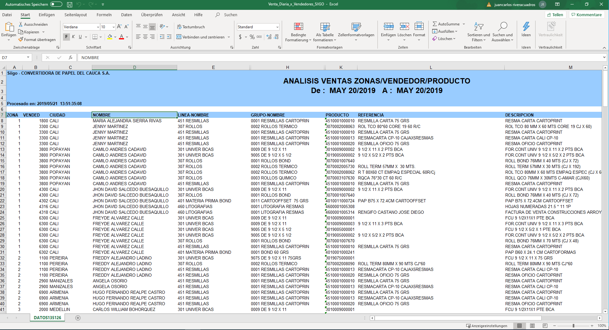
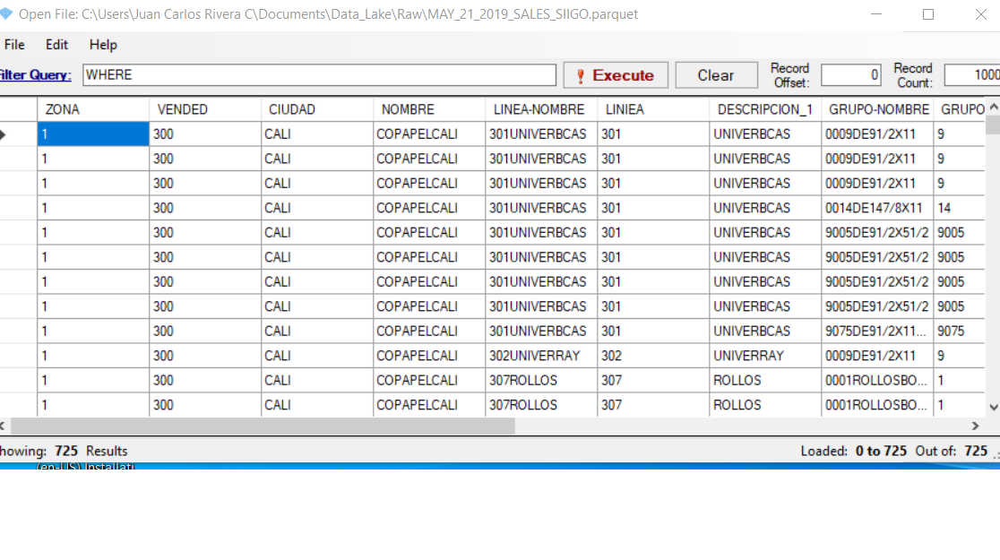

# sales_table_SIIGO_xlsx

SIIGO is an accounting and management software. From this software you get some xlsx files. This is an example to clean and convert these files into parquet and save the new files in a Data Lake. The code is in this [link](https://github.com/juancarlosriveracuadros/sales_table_SIIGO_xlsx/blob/main/Cleaning_sales_SIIGO_table_save_as_Parquet.py)

## SIIGO file

## Parquete file

